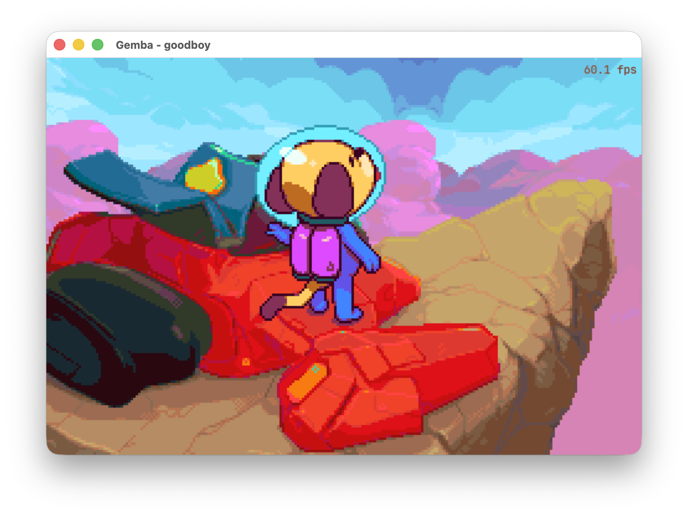

# gemba

A Crystal/Tryst port of gemba, a GBA emulator frontend (ruby original:
`teek` + libmgba).

Its main job is to be a real, non-trivial application built on Tryst -
the kind of thing that finds the rough edges a widget-by-widget test
suite never will: real concurrency (a full emulation loop running
alongside Tk's own event loop), real file I/O, a real native CDN fetch,
a settings UI, modals, hotkeys, all of it. Every gap it exposes in Tryst
gets fixed in Tryst, not worked around here. A working, genuinely
playable GBA frontend is very much the goal too - just the second one.

It lives inside this monorepo so a change to Tryst/tryst-sdl that gemba
needed can land in the same commit as the code that needed it, rather
than across two repos with a version bump in between.

## Screenshots



## Building

```
shards install
crystal spec                    # host
scripts/docker-test.sh          # Debian forky, same suite
```

Needs whatever tryst and tryst-sdl need (Crystal >= 1.21.0, Tcl/Tk 8.6,
SDL3), plus libmgba and rcheevos - see the Dockerfile for how the
container builds both from source, or tryst-sdl's own README for
per-platform SDL package names.

## Developing (host build)

`crystal run`/`crystal spec` on host need three vendored artifacts that
git does not track and nothing builds automatically - do this once
before your first host build (the Dockerfile runs the identical recipe
for the container image):

```
# 1. libmgba, built minimal (no Qt/SDL frontend, no GL) - same flags
#    the Dockerfile uses, so keep them in sync if either changes.
mkdir -p vendor
git clone --depth 1 --branch 0.10.5 https://github.com/mgba-emu/mgba.git vendor/mgba
cmake -S vendor/mgba -B vendor/build \
  -DMARKDOWN= \
  -DBUILD_SHARED=OFF -DBUILD_STATIC=ON \
  -DBUILD_QT=OFF -DBUILD_SDL=OFF \
  -DBUILD_GL=OFF -DBUILD_GLES2=OFF -DBUILD_GLES3=OFF \
  -DBUILD_LIBRETRO=OFF -DSKIP_FRONTEND=ON \
  -DUSE_SQLITE3=OFF -DUSE_ELF=OFF -DUSE_LZMA=OFF -DUSE_EDITLINE=OFF -DUSE_FFMPEG=OFF \
  -DCMAKE_POSITION_INDEPENDENT_CODE=ON \
  -DCMAKE_INSTALL_PREFIX="$(pwd)/vendor/mgba-install" \
  -DCMAKE_POLICY_VERSION_MINIMUM=3.5
cmake --build vendor/build -j "$(nproc)"
cmake --install vendor/build
rm -rf vendor/mgba vendor/build

# 2. rcheevos, pinned to the commit ruby gemba's own vendor/rcheevos
#    submodule uses.
git clone --quiet https://github.com/RetroAchievements/rcheevos.git vendor/rcheevos
git -C vendor/rcheevos checkout --quiet e9ca3694c862b61235595176dac4b22677848c93
scripts/build_rcheevos.sh
rm -rf vendor/rcheevos

# 3. native/null_logger.o - real C (a genuine va_list parameter Crystal
#    can't express), built against libmgba's just-installed headers.
cc -c -I vendor/mgba-install/include native/null_logger.c -o native/null_logger.o
```

`vendor/` and `native/*.o` are both gitignored - this is a local build
step, not something to commit. Re-run it whenever `vendor/mgba-install`,
`vendor/rcheevos-build`, or `native/null_logger.o` go missing (e.g.
after a clean checkout).
